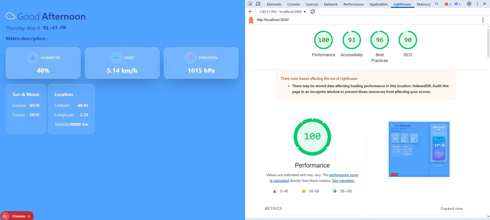

<h1>🌦️ Weather App — Built with Next.js 15, Tailwind CSS & Redux</h1>

  This is a modern weather application built using
  <a href="https://nextjs.org/" target="_blank">Next.js</a> 15+ (with App Router), styled with Tailwind CSS, and powered by Redux for state management.
  It integrates with external weather APIs and supports caching via Upstash Redis.

<h2>🚀 Features</h2>
<ul>
  <li>🔍 Search for weather by city name</li>
  <li>🧠 Redux Toolkit for global state management</li>
  <li>🎨 Tailwind CSS 4 for responsive styling</li>
  <li>🗃️ Upstash Redis caching for faster responses</li>
  <li>💨 Framer Motion animations</li>
  <li>🌐 Deploy-ready for <a href="https://www.netlify.com/" target="_blank">Netlify</a> </li>
  <li>📦 Optimized with Turbopack for development</li>
</ul>

<h2>🧑‍💻 Getting Started</h2>

<h3>1. Install dependencies</h3>
<pre><code>npm install
# or
yarn install</code></pre>

<h3>2. Run the development server</h3>
<pre><code>npm run dev
# or
yarn dev</code></pre>

  Open <a href="http://localhost:3000" target="_blank">http://localhost:3000</a> in your browser to view the app.

<h3>3. Build for production</h3>
<pre><code>npm run build
npm start</code></pre>

<h2>🧱 Tech Stack</h2>
<ul>
  <li><strong>Framework</strong>: <a href="https://nextjs.org/">Next.js 15</a></li>
  <li><strong>Styling</strong>: <a href="https://tailwindcss.com/">Tailwind CSS 4</a></li>
  <li><strong>State Management</strong>: <a href="https://redux-toolkit.js.org/">Redux Toolkit</a></li>
  <li><strong>API</strong>: <a href="https://axios-http.com/">Axios</a></li>
  <li><strong>Icons</strong>: <a href="https://react-icons.github.io/react-icons/">React Icons</a></li>
  <li><strong>Animations</strong>: <a href="https://www.framer.com/motion/">Framer Motion</a></li>
  <li><strong>Caching</strong>: <a href="https://upstash.com/redis">Upstash Redis</a></li>
  <li><strong>Deployment</strong>: Netlify </li>
</ul>

<h2>🌍 Environment Variables</h2>

Create a <code>.env.local</code> file at the root of your project and add:

<pre><code>WEATHER_API_KEY=your_openweather_key
REDIS_REST_URL=your_upstash_url
REDIS_REST_TOKEN=your_upstash_token</code></pre>

<h2>☁️ Deployment on Netlify</h2>
<ol>
  <li>Ensure <code>@netlify/plugin-nextjs</code> is listed in your dependencies.</li>
  <li>Create a <code>netlify.toml</code> file:</li>
</ol>

<pre><code>[build]
  command = "npm run build"
  publish = ".next"

[[plugins]]
  package = "@netlify/plugin-nextjs"
</code></pre>

<ol start="3">
  <li>Push your code to GitHub and connect your repo to Netlify.</li>
  <li>Add environment variables in the Netlify dashboard.</li>
  <li>Click <strong>Deploy Site</strong>.</li>
</ol>

<h2>📚 Resources</h2>
<ul>
  <li><a href="https://nextjs.org/docs">Next.js Documentation</a></li>
  <li><a href="https://tailwindcss.com/docs">Tailwind CSS Docs</a></li>
  <li><a href="https://redux-toolkit.js.org/">Redux Toolkit</a></li>
  <li><a href="https://upstash.com/docs">Upstash Redis</a></li>
</ul>

<h2>🤝 Contributing</h2>

  Pull requests and feedback are welcome! For major changes, please open an issue first to discuss what you'd like to change.

## 📸 Screenshots

Voici un aperçu de l'application Weather App, <strong>avant et après l'implémentation du cache avec Upstash Redis</strong> :

  

    <h3 style="margin-bottom: 10px;">🟠 Avant l'utilisation du cache (requête directe à l'API)</h3>
    
  

  

    <h3 style="margin: 20px 0 10px;">🟢 Après l'utilisation du cache Redis (temps de réponse optimisé)</h3>
    
  

✅ Grâce à l’intégration de <strong>Redis</strong>, les performances ont été significativement améliorées avec un temps de réponse plus rapide et une réduction de la charge sur l’API.

<pre><code>REDIS_REST_URL=your_upstash_url
REDIS_REST_TOKEN=your_upstash_token</code></pre>

We use the Redis client to store and retrieve weather data, ensuring that repeated requests do not require a new API call if the data is cached.

Once your environment variables are set, Redis will handle caching automatically on the server side!

Made with ❤️ by <strong>Aymane RACHID</strong>

